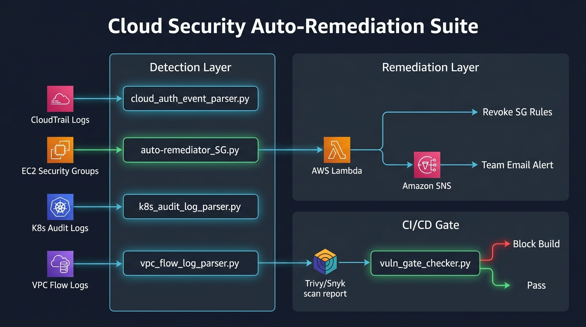

# 🔐 Cloud Security Auto-Remediation Suite

A Python-based cloud security automation toolkit that **detects, remediates, and reports** security threats across AWS, Kubernetes, and CI/CD pipelines — in real time.



---

## 🚀 What It Does

| Layer | Script | Description |
|-------|--------|-------------|
| **Detection** | `detection/cloud_auth_event_parser.py` | Parses AWS CloudTrail logs for failed console logins and logins without MFA |
| **Detection** | `detection/k8s_audit_log_parser.py` | Flags unauthorized Kubernetes API calls (401/403) and suspicious `kubectl exec` into pods |
| **Detection** | `detection/vpc_flow_log_parser.py` | Analyzes VPC Flow Logs for rejected SSH/RDP traffic — a classic brute-force indicator |
| **Remediation** | `remediation/auto-remediator_SG.py` | Scans production EC2 Security Groups for ports open to the internet (0.0.0.0/0) and triggers Lambda |
| **Remediation** | `remediation/lambda_remediator.py` | AWS Lambda that auto-revokes risky SG inbound rules and emails the team via Amazon SNS |
| **CI/CD** | `cicd/vuln_gate_checker.py` | Pipeline gate that blocks builds with fixable CRITICAL/HIGH CVEs (CVSS ≥ 8.0) from Trivy or Snyk |

---

## 🏗️ Architecture

1. **Detection Layer** — Python scripts parse CloudTrail, Kubernetes audit logs, and VPC Flow Logs to surface threats.
2. **Remediation Layer** — The SG auto-remediator triggers an AWS Lambda function that revokes dangerous firewall rules and sends email alerts via Amazon SNS.
3. **CI/CD Gate** — A scanner-agnostic vulnerability checker that auto-detects Trivy or Snyk JSON reports and fails the pipeline on actionable vulnerabilities.

---

## 📂 Repo Structure

```
├── detection/
│   ├── cloud_auth_event_parser.py    # CloudTrail auth anomaly detector
│   ├── k8s_audit_log_parser.py       # K8s audit log threat detector
│   └── vpc_flow_log_parser.py        # VPC Flow Log analyzer
├── remediation/
│   ├── auto-remediator_SG.py         # Security Group scanner + Lambda trigger
│   ├── lambda_remediator.py          # Lambda: revoke rules + SNS notification
│   ├── auto-remediator_SG_explanation.md
│   └── start_stopped_instances.py    # Utility: restart stopped EC2 instances
├── cicd/
│   └── vuln_gate_checker.py          # Trivy/Snyk vulnerability gate
├── samples/
│   ├── cloudtrail_ec2_events.json    # Sample CloudTrail data
│   └── sample_vpc_flow_logs.txt      # Sample VPC Flow Logs
├── requirements.txt
└── README.md
```

---

## ⚡ Quick Start

### Prerequisites

- Python 3.8+
- AWS CLI configured with credentials (`aws configure`)
- `boto3` installed

### Install

```bash
git clone https://github.com/dabu13/copilotremediate.git
cd copilotremediate
pip install -r requirements.txt
```

### Run the Detection Scripts

```bash
# Parse CloudTrail logs for auth anomalies
python detection/cloud_auth_event_parser.py samples/cloudtrail_ec2_events.json

# Parse VPC Flow Logs for rejected admin-port traffic
python detection/vpc_flow_log_parser.py samples/sample_vpc_flow_logs.txt

# Parse Kubernetes audit logs (provide your own JSONL file)
python detection/k8s_audit_log_parser.py <path_to_k8s_audit.jsonl>
```

### Run the Auto-Remediator

```bash
python remediation/auto-remediator_SG.py
```

> **Note:** Requires a deployed Lambda function (`lambda_remediator.py`) and an SNS topic.

### Run the CI/CD Vulnerability Gate

```bash
# Against a Trivy JSON report
python cicd/vuln_gate_checker.py trivy-report.json

# Against a Snyk JSON report (auto-detected)
python cicd/vuln_gate_checker.py snyk-report.json

# Custom CVSS threshold
python cicd/vuln_gate_checker.py trivy-report.json --min-cvss 9.0
```

Exit codes: `0` = pass, `1` = vulnerabilities found, `2` = input error

---

## 🔧 Remediation Setup

1. **Deploy the Lambda** — Upload `remediation/lambda_remediator.py` to AWS Lambda with `SNS_TOPIC_ARN` env var
2. **Create an SNS Topic** — Subscribe your email and confirm
3. **Update the Lambda ARN** — Replace the placeholder in `remediation/auto-remediator_SG.py`
4. **Schedule** — Use cron, EventBridge, or CI/CD to run periodically

---

## 🧰 Tech Stack

- **Language:** Python 3 + Boto3
- **Cloud:** AWS (EC2, Lambda, SNS, CloudTrail, VPC Flow Logs)
- **Containers:** Kubernetes Audit Logs
- **Scanning:** Trivy, Snyk

---

## 💡 Design Decisions

| Decision | Rationale |
|----------|-----------|
| Lambda uses async invocation (`InvocationType='Event'`) | Scanner never blocks waiting for remediation |
| Amazon SNS for notifications | No hardcoded email creds, no SMTP config |
| Vuln gate auto-detects scanner format | Supports both Trivy and Snyk JSON without flags |
| All scripts are standalone | No frameworks, no shared state |

---

## 📄 License

MIT License. See [LICENSE](LICENSE) for details.

---

> Built with 🛡️ by a security engineer who got tired of manually checking Security Groups at 2 AM.
